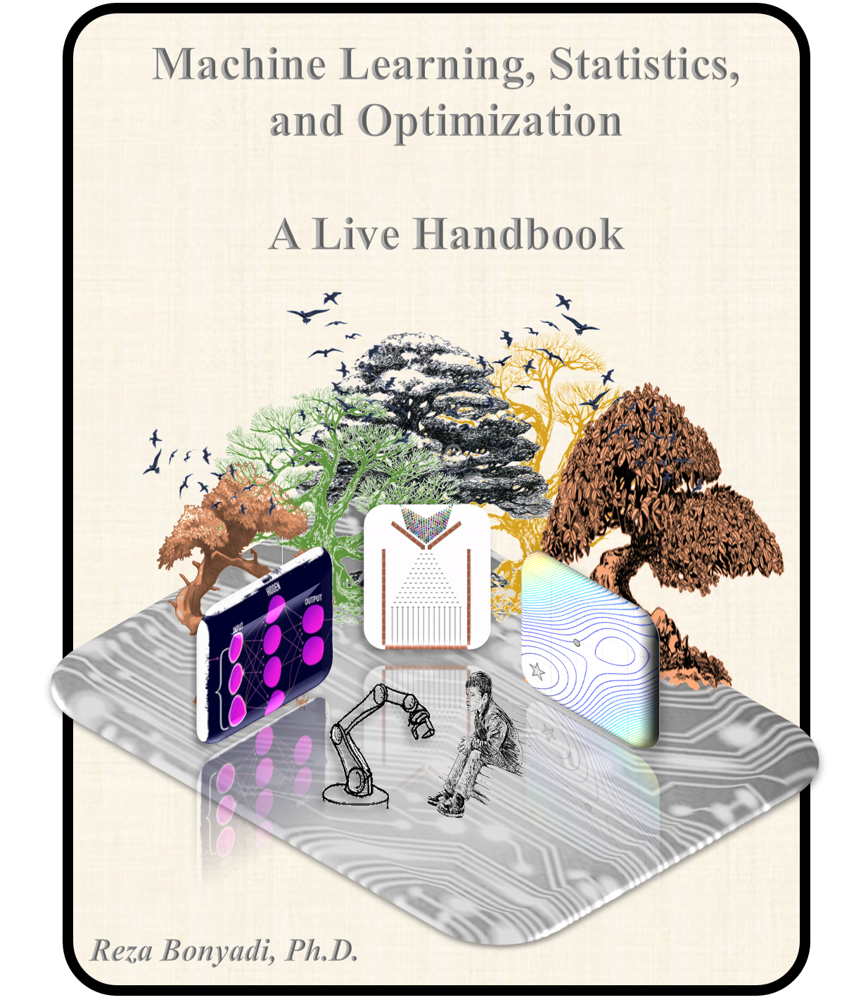

# Preface {-}

I wrote my first machine learning (ML) project in the autumn of 2000, which was a characters hand-written recognition in the Pascal language. The field of ML is growing astronomically fast these days and everyday I am learning something new. One reason behind such a fast growth is that the top largest companies in the world, i.e., Microsoft, Google, Amazon, and Apple, all invest their largest R&D budgets on this topic (see [Medium](https://medium.com/@paysa/artificial-intelligence-ai-tech-talent-race-is-booming-d3e15bde3ba0)).

This collection (or as I call it, hyper-book) is meant to document and centralize the best links, descriptions, and materials in each topic I found for my learning (so, basically my notes in an organized way with links). The intention is not to re-write what has been written hundreds of times by very skilled authors as books or blogs, but to summarize methods, list best pages/books which describe them, how they have been evolving recently, and refer to programming codes I found the best for that topic, if relevant. For each topic I provide my opinion and intuition on what it is, what are examples of it, and how to find more details. I keep the descriptions simple and to the point, with minimum mathematical equations, if possible. 

The idea of this collection is not to undermine any Mathematical finding and theoretical background related to the fields reviewed here (I personally am a fan). It is rather to pair those with intuitions and examples to make these topics more accessible for larger audience. It is also important to notice the way this collection has been organized (machine learning, statistics, and optimization) is not ideal as it is difficult to separate these topics completely. I agree that many algorithms in machine learning these days are "old news" in the field of statistics (e.g., linear regression), while some other algorithms may not have been possible to invent if statistics was going to be the main stream (e.g., deep neural networks). Topics like derivative-based optimization are so heavily involved in machine learning these days to an extent to which they owe their maturity to some extent. It is really difficult to claim if different parts of this collection are really different, however, the grouping has been taken place for the sake of cleanness and familiarity of the titles.

Each section in this book is tagged whether the discussion in that section is going to be intuitive, based on the code, or deep mathematics. This would help the audience to pick the sections which they care about most, which makes the reading more effective and enjoyable.

